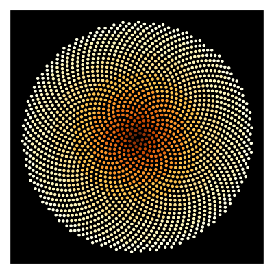

# practice-Diagrams-hs

HaskellでDiagramパッケージを使用して画像を描写します。



## 実行方法

```shell
# パッケージのインストール
stack setup

# コンパイル
stack build

# 実行
stack exec -- practice-Diagrams-hs-exe <コマンドライン引数>
```

## 参考文献

- [公式ドキュメント](https://diagrams.github.io/doc/quickstart.html)
- [ギャラリー](https://archives.haskell.org/projects.haskell.org/diagrams/gallery.html)
